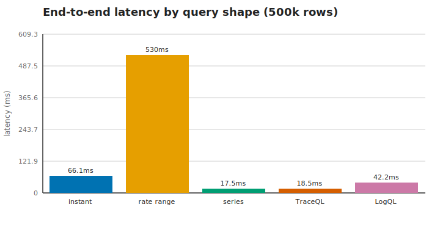
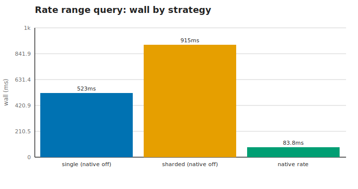
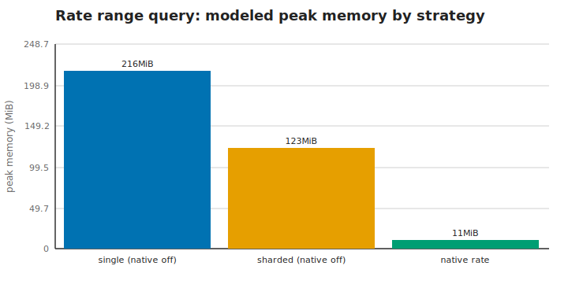
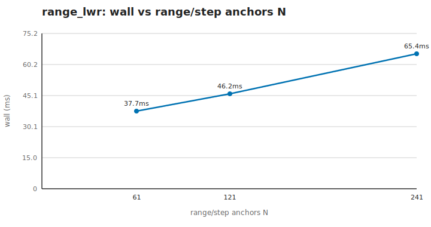
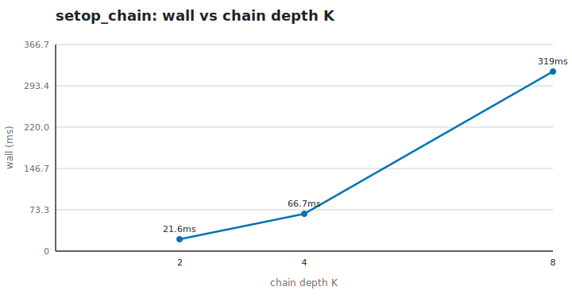

# Cerberus benchmarks

Cerberus turns a Prometheus / Loki / Tempo query into ClickHouse SQL, runs it, and streams the result back in the upstream wire format. This document measures **how fast that pipeline is and how much memory it costs** — end to end, for the query shapes a real dashboard sends.

**The one-sentence headline:** on a realistic 500k-row dataset every common query returns in tens of milliseconds, and the one genuinely expensive shape — a `rate(…)` range query — is exactly the shape cerberus has two complementary tools for: the **native `timeSeriesRateToGrid` lowering**, which removes the row fan-out entirely, and the **sharded solver**, which keeps the fan-out under a per-query memory cap.

**What this is.** A latency-and-memory profile of the query pipeline: parse → lower → optimize → emit SQL → execute → format. **What this is not.** A load test. There is no concurrency, no network, no ingest path here — every number is the cost of *one* query running *alone* against an embedded ClickHouse engine. That makes the numbers stable and comparable; it also means they are a floor, not a throughput figure.

Every number below is **measured**, not estimated, and the whole document is regenerated by a single command — see [Reproducing](#reproducing).

## Environment

All measurements run **in-process** against an embedded ClickHouse engine ([chDB](https://github.com/chdb-io/chdb), the ClickHouse engine compiled as a library) — no server, no socket, no Docker. The engine is the real ClickHouse query executor, so the SQL cerberus emits runs exactly as it would against a standalone ClickHouse.

These numbers were captured on the host below — read directly from `/proc` and `/sys` at generation time, so the spec stays accurate and regenerates with the rest of the document.

| component      | value                                                    |
| -------------- | -------------------------------------------------------- |
| CPU            | Intel(R) Core(TM) i7-10510U CPU @ 1.80GHz                |
| CPU vendor     | GenuineIntel                                             |
| CPU family     | family 6, model 142, stepping 12                         |
| CPU topology   | 4 physical cores / 8 logical threads                     |
| Max clock      | 4900 MHz                                                 |
| CPU cache      | L1d 32 KiB ×4, L1i 32 KiB ×4, L2 256 KiB ×4, L3 8 MiB ×1 |
| Memory         | 31.2 GiB                                                 |
| OS             | Ubuntu 24.04.4 LTS                                       |
| Kernel         | 6.8.0-110-generic                                        |
| Go toolchain   | go1.26.2                                                 |
| Go platform    | linux/amd64                                              |
| runtime.NumCPU | 8                                                        |
| Query engine   | ClickHouse 25.8 (via chDB / chdb-go, in-process)         |

> **Your numbers will differ.** Absolute timings depend on the CPU, the Go build, and the machine's load at the time. Treat the millisecond figures as *order-of-magnitude*; the **ratios** between shapes (and the deterministic row / granule counts) are what carry across hardware. Regenerate on your own box with `just bench-report`.

## Methodology

**Why an in-process engine.** Running ClickHouse as a library removes the two biggest sources of noise — network round-trips and a separately-scheduled server process. What's left is the cost of the query itself, which is what we want to measure. It also makes the whole suite reproducible from one `go run` with no infrastructure to stand up.

**Two kinds of measurement.**

- **End-to-end** numbers drive a real query the whole way through cerberus's production pipeline and execute the emitted SQL on chDB. They answer *"how long does this query take?"*
- **Micro-benchmarks** isolate one Go stage (lowering, the optimizer, SQL emission) with `go test -bench`, with no database involved. They answer *"how much does this one stage cost?"* and catch per-stage allocation regressions.

**What a "wall" number means.** The wall time is the time to execute the emitted SQL on chDB, taken as the **best of 9** runs. The fastest run is the cleanest estimate — it is the one least perturbed by GC pauses and OS scheduling, so the floor is the most stable single-process signal. Micro-benchmarks use `-benchtime 10x`.

**What a "peak memory" number means.** chDB does not expose a per-query peak-memory metric and never enforces a memory cap, so peak memory is **modeled**, not measured directly: we count the intermediate rows a query materializes (the deterministic driver of memory) and scale that by a single published calibration constant. Wherever a memory figure appears it is labelled *modeled*; the **row count** it derives from is always measured.

**The dataset: ~500k datapoints.** The end-to-end queries run over a synthetic OpenTelemetry dataset of **500,000** metric samples, **500,000** log records, and **500,000** spans, generated server-side via `numbers(N)` (no row-by-row inserts). Half a million datapoints per signal is the realistic scale of a busy dashboard panel — big enough that scan cost and fan-out are visible, small enough that the numbers reflect normal operation rather than a pathological stress artifact.

**Determinism.** Structural metrics — intermediate row counts, granules read, `allocs/op` — are deterministic and committed verbatim, so a regenerated document diffs cleanly on them. Timings (`ns/op`, wall, latency) are machine-dependent and presented as ratios wherever a before/after exists. This document is a **manually-regenerated artifact, not a CI gate** — no test fails on timing drift. Structural regressions are guarded separately by the cardinality ratchet (`test/perf/cardinality_ratchet_test.go`) and the scaling harness (`test/perf/scaling/`).

## End-to-end: the `query_range` path

This is the section to read first. Each query below is driven through the **entire production pipeline** — the exact sequence `internal/engine` runs for a live request:

```text
parse the query  →  lower to the plan IR  →  optimize (optimizer.Default)
  →  emit ClickHouse SQL  →  execute on chDB  →  shape the wire response
```

Nothing is stubbed: the SQL measured is the SQL cerberus emits, and it runs on the same 500k-row dataset described above. The query shapes span all three heads and the API endpoints a Grafana dashboard actually hits — an instant evaluation, a **`query_range`** rate over a step grid (the workhorse panel query), a `/series` label lookup, a TraceQL span search, and a LogQL range count.

| query                   | head    | scan rows | latency |
| ----------------------- | ------- | --------- | ------- |
| instant query           | promql  | 500,000   | 66.1ms  |
| range query (240 steps) | promql  | 500,000   | 529.9ms |
| series lookup           | promql  | 500,000   | 17.5ms  |
| TraceQL search          | traceql | 500,000   | 18.5ms  |
| LogQL range             | logql   | 500,000   | 42.2ms  |



Query shapes:

- **instant query** (`promql`): `sum(rate(e2e_http_requests[5m]))`
- **range query (240 steps)** (`promql`): `sum(rate(e2e_http_requests[5m]))`
- **series lookup** (`promql`): `/series?match[]=e2e_http_requests`
- **TraceQL search** (`traceql`): `{ span.http.status_code = 500 }`
- **LogQL range** (`logql`): `count_over_time({service="e2e"} |= "error" [5m])`

Four of the five shapes land in the tens of milliseconds. The outlier is the **rate range query** — and that is not an accident of this benchmark but the inherent shape of the problem: a `rate(…[5m])` evaluated across a 1-hour grid at a 15-second step has to consider, for every step, the samples in its trailing 5-minute window. That overlap is a genuine fan-out, and it is the subject of the next section.

## The expensive shape: rate-range query — three strategies

The rate range query is where cerberus's two performance levers come into play. They are **not independent dials** — they are two *alternative* remedies for the same row fan-out:

- **Sharding** (the [sharded-pushdown solver](solver.md), route B) makes the fan-out *fit*. It re-anchors the *same* plan onto **K disjoint anchor-grid shards**, each a separate statement over a slice of the grid; no shard sees more than ~1/K of the fan-out, so each one stays under the per-query memory cap.
- **Native rate** (`ts_grid_range` in `CERBERUS_CH_OPTIMIZATIONS`, or the deprecated `CERBERUS_EXPERIMENTAL_TS_GRID_RANGE` alias) makes the fan-out *vanish*. ClickHouse's native `timeSeriesRateToGrid` aggregate computes every grid point's rate in a single pass with **no row fan-out at all** — it never builds the `(sample, anchor)` matrix. It needs ClickHouse ≥ 25.6 (the substrate here is 25.8). It is experimental, so the optimization auto-picker never enables it implicitly; the stable wins (`aggregation_in_order`, `condition_cache`) are the ones `auto` turns on for you.

Because native rate *removes* the fan-out, the two levers do not stack: with native rate on there is no fan-out spine left for the sharded solver to slice, so any route collapses to a single statement. That leaves exactly **three genuinely distinct strategies** for this query, not a route × native-rate grid.

**The focus query** is the same rate range query_range from the table above — `sum(rate(e2e_http_requests[5m]))` over 1h at a 15s step (fan-out F = Range/Step = **20**, grid N = **241** steps), on the **500,000**-row metrics seed. Each strategy drives the full pipeline for its configuration and reports two numbers: the measured **wall** time and the modeled per-statement **peak memory**.

| strategy             | statements | wall    | peak mem | note                                    |
| -------------------- | ---------- | ------- | -------- | --------------------------------------- |
| single (native off)  | 1          | 522.9ms | 216 MiB  | baseline — whole fan-out in one query   |
| sharded (native off) | 8          | 915.1ms | 123 MiB  | fan-out sliced to fit (K=8 shards)      |
| native rate          | 1          | 83.8ms  | 11 MiB   | fan-out removed (single-pass aggregate) |

`auto` (the production default) picks the sharded route for this query when native rate is off; with native rate on it collapses to a single statement — so `auto` does not earn its own row, it lands on one of the three above depending on the flag.





**Reading the three strategies.**

- **single = the baseline, and the problem.** The whole fan-out runs in one statement: ~10,000,000 intermediate `(sample, anchor)` rows materialize before the `GROUP BY` collapse (**modeled 216 MiB**). That is the single-query memory this whole section is about reducing.
- **sharded = trade statement count for a lower per-query peak.** Slicing into K=8 statements cuts the worst shard to ~5,680,000 rows (**modeled 123 MiB**) — a **1.8×** reduction in per-query peak memory, which is what fits it under the cap. The shards run sequentially on this single in-process engine, so the *wall* here is the conservative sum; in production they run on parallel ClickHouse connections.
- **native rate = remove the fan-out at the source.** With `timeSeriesRateToGrid` on, the intermediate drops from ~10,000,000 rows to ~500,000 (**modeled 11 MiB**, down from 216 MiB) — the aggregate never builds the `(sample, anchor)` matrix at all, so it collapses to a single-pass statement and the execution route is moot. Where sharding makes the fan-out *fit*, the native path makes it *vanish*.

So the two remedies do not compose into a four-way grid — they are a choice. `auto` routing keeps any deployment safe under the memory cap today by sharding the fan-out; turning the native-rate flag on collapses the fan-out at its source for the deployments whose ClickHouse is new enough, at which point there is nothing left to shard. The [sharded solver section](#sharded-solver-the-memory-cap-win) below works the memory arithmetic against the real production cap.

## Sharded solver: the memory-cap win

The matrix showed *that* sharding cuts per-query memory; this section shows it against the **real production cap**. ClickHouse data-plane queries run under a **1.00 GiB** per-query memory limit (`CERBERUS_CH_QUERY_MAX_MEMORY`). A high-fan-out matrix range query can exceed it in a single statement — the failure mode the [sharded-pushdown solver](solver.md) exists to prevent.

**The fixture.** `sum(rate(bench_shard_total[5m]))` @ 15s over 1h — fan-out F = **20**, grid N = **241**. Seeded with **13,000** series and **3,393,000** scanned samples, sized so a single statement crosses the cap while every shard stays under it.

| route                | statements | (sample,anchor) pairs | modeled peak | vs 1.00 GiB cap       |
| -------------------- | ---------- | --------------------- | ------------ | --------------------- |
| A — single statement | 1          | 62,660,000            | 1.32 GiB     | **OOM** (exceeds cap) |
| B — sharded (K=8)    | 8          | 8,060,000 (max)       | 174 MiB      | clears                |

Route A's modeled peak (**1.32 GiB**) **exceeds** the cap; every route-B shard's modeled peak (**174 MiB**) sits under it with **5.9× headroom**. The shards partition route A's work exactly — the per-shard pair counts sum to route A's total (62,660,000), with no double-count — so the worst shard carries ~1/K of the fan-out, a **7.8×** reduction.

> **On "modeled."** The `(sample, anchor)` pair count is **measured live on chDB** — it is the deterministic driver of per-statement memory (the matrix `arrayJoin` materializes one row per pair before the `GROUP BY` collapse). The **GiB are modeled**: chDB never OOMs, so the pair counts are scaled by one published calibration constant — a worked spike's 2.12 GiB at ≈100.4M pairs (≈23 B/pair). The measured pair-count reduction is the real, deterministic result; the GiB framing maps it onto the cap the design respects.

Per-shard measured pairs (oldest-first): shard 0 = 6,240,000, shard 1 = 8,060,000, shard 2 = 8,060,000, shard 3 = 8,060,000, shard 4 = 8,060,000, shard 5 = 8,060,000, shard 6 = 8,060,000, shard 7 = 8,060,000.

## Scaling: wall vs cardinality

A query optimization is only durable if it stays bounded as the data grows. Each registered construct (`test/perf/scaling/`) is swept across a growing fan-out parameter, holding the scan size fixed, and we watch two things: the wall time, and `fan_factor` — the peak intermediate cardinality divided by the scan rows. A bounded shape keeps `fan_factor` roughly flat as the parameter grows: the intermediate stays a small constant multiple of the scan, never `rows × parameter`.

### range_lwr — sweep range/step anchors N

Scan rows held fixed at 180,000.

| param | wall   | peak rows | fan_factor |
| ----- | ------ | --------- | ---------- |
| 61    | 21.2ms | 48,000    | 0.27       |
| 121   | 25.1ms | 84,000    | 0.47       |
| 241   | 38.2ms | 156,000   | 0.87       |



Parameter grew **4.0×** across the sweep; wall grew **1.8×** (sub-linear). `fan_factor` stayed bounded (0.27 → 0.87).

### setop_chain — sweep chain depth K

Scan rows held fixed at 9.

| param | wall    | peak rows | fan_factor |
| ----- | ------- | --------- | ---------- |
| 2     | 21.6ms  | 3         | 0.33       |
| 4     | 66.7ms  | 5         | 0.56       |
| 8     | 318.9ms | 9         | 1.00       |



Parameter grew **4.0×** across the sweep; wall grew **14.8×** (tracks the parameter — see the note below). `fan_factor` stayed bounded (0.33 → 1.00).

> **Note.** The `setop_chain` curve runs through the optimizer, so the `FlattenVectorSetOp` rule collapses the left-assoc `a or b or c …` nesting into one N-ary `UNION ALL` under a single window pass — the chain is one scan, not K nested window passes, so **both** the wall and the cardinality axis are flat in chain depth and the harness hard-gates both. (`unless` is not associative, so an `unless` chain keeps its binary nesting by construction.)

## Optimizer before/after wins

Cerberus's optimizer rewrites each plan before emission. These are the individual wins, each pairing the **naive** pre-optimization SQL against the **optimized** shape cerberus actually emits, both run live on chDB. The `win` column is the deterministic structural ratio where one exists (granules read, rows scanned, peak cardinality), else the indicative wall-time speedup.

| optimization              | win   | basis                                         |
| ------------------------- | ----- | --------------------------------------------- |
| range-LWR collapse        | 56.9× | wall time (indicative)                        |
| set-op single-pass        | 18.1× | arm rows scanned (deterministic)              |
| MetricName-first ORDER BY | 17.0× | granules read (deterministic)                 |
| bounded recursion         | 50.0× | rows read per recursion level (deterministic) |

### range-LWR collapse

- **Scenario:** query_range over a bare selector, 241 step anchors
- **Naive:** N-anchor StepGrid CROSS JOIN (O(rows × anchors))
- **Optimized:** single-pass RangeLWR, sample-side fan-out bounded by lookback/step
- **peak intermediate rows (deterministic):** 43,380,000 → 156,000 (**278.1× fewer**)
- **Wall (indicative):** 2.39s → 42.0ms (**56.9× faster**)

### set-op single-pass

- **Scenario:** left-assoc `or` chain, depth K=6
- **Naive:** exponential LHS duplication (arm i re-scanned 2^(K−i) times)
- **Optimized:** single-pass UNION-ALL + window (each arm scanned once)
- **arm rows scanned (deterministic):** 254,000 → 14,000 (**18.1× fewer**)
- **Wall (indicative):** 75.2ms → 167.6ms — the optimized single-pass shape still carries the unrelated left-assoc K-nesting residual (#90), so the wall ratio understates the win; the deterministic re-execution ratio is the headline

### MetricName-first ORDER BY

- **Scenario:** metric-only query (no service.name), 600000 rows
- **Naive:** ServiceName-first sort key → generic exclusion scan
- **Optimized:** MetricName-first sort key → PK range prune
- **granules read (deterministic):** 51 → 3 (**17.0× fewer**)
- **Wall (indicative):** 4.2ms → 2.3ms (**1.8× faster**)

### bounded recursion

- **Scenario:** structural `>>` closure, depth D=48
- **Naive:** bare full-table re-scan per level (O(depth × full-scan))
- **Optimized:** candidate trace-id set pushed into recursive arm
- **rows read per recursion level (deterministic):** 60,000 → 1,200 (**50.0× fewer**)
- **Wall (indicative):** 787µs → 2.0ms — the win is the PER-LEVEL row count, multiplied across all 48 recursion levels; a single-frontier wall does not capture the depth multiplier, so the deterministic per-level ratio is the headline

## Micro-benchmarks

Per-stage Go benchmarks, no database involved — they isolate the cost of one pipeline stage so an allocation regression in, say, lowering can't hide behind a fast query. `allocs/op` and `B/op` are deterministic; `ns/op` is indicative. Read the `package` column as the stage: `promql`/`logql`/`traceql` parse + lower, `optimizer` rewrites the plan, `chsql` emits SQL, `chplan` is the IR, `solver` is the sharded-pushdown slicer (`Slice/K=*` measures one `unpinSpine` plus K `ReanchorRange` calls on the copy-on-write off-spine sharing path), `api/*` is the wire layer.

| package    | benchmark                            | ns/op         | B/op          | allocs/op |
| ---------- | ------------------------------------ | ------------- | ------------- | --------- |
| api/format | CanonicalKey_Large                   | 2,508         | 1,016         | 8         |
| api/format | CanonicalKey_Small                   | 710           | 216           | 6         |
| api/format | PromLabelToOTelCandidates_Cached     | 45            | 0             | 0         |
| api/format | PromLabelToOTelCandidates_SumByQuery | 299           | 0             | 0         |
| api/format | PromLabelToOTelCandidates_Uncached   | 1,378         | 136           | 4         |
| api/prom   | ExecuteRangeStreaming                | 144,739,449   | 120,175,240   | 1402461   |
| api/prom   | HandleLabels                         | 87,205        | 28,027        | 161       |
| api/prom   | HandleQueryRange_Large               | 2,022,945     | 1,614,742     | 16325     |
| api/prom   | HandleQueryRange_Small               | 248,646       | 110,661       | 1101      |
| api/prom   | HandleQuery_Small                    | 183,543       | 49,244        | 492       |
| api/prom   | HandleSeries/broad                   | 4,311,226,392 | 4,965,324,523 | 37765296  |
| api/prom   | HandleSeries/typical                 | 2,258,302     | 2,062,501     | 18988     |
| api/prom   | StreamingCursor_100K_Series          | 1,550,127,460 | 1,529,472,056 | 15598476  |
| api/prom   | StreamingCursor_1M_Points            | 1,423,789,780 | 1,432,337,993 | 14759491  |
| api/prom   | StreamingCursor_Stop_Mid             | 91,919,924    | 77,311,208    | 851937    |
| chclient   | RowsCursor_DrainLarge                | 3,807,831     | 2,320,259     | 80002     |
| chclient   | RowsCursor_DrainSmall                | 32,643        | 17,056        | 602       |
| chplan     | Equal                                | 1,658         | 0             | 0         |
| chplan     | Walk                                 | 231           | 80            | 5         |
| chsql      | Builder_NewAndBuild                  | 3,354         | 1,064         | 12        |
| chsql      | Frag_Construction                    | 1,179         | 952           | 34        |
| chsql      | QueryBuilder_Build                   | 2,668         | 1,064         | 12        |
| logql      | Lower_LineFilterChain                | 1,320         | 968           | 22        |
| logql      | Lower_MetricForm                     | 5,851         | 4,640         | 119       |
| logql      | Lower_StreamMatcher                  | 1,157         | 680           | 15        |
| optimizer  | Driver_Run                           | 9,566         | 4,880         | 62        |
| promql     | Lower_Aggregation                    | 5,524         | 4,019         | 100       |
| promql     | Lower_Binary                         | 3,456         | 2,576         | 64        |
| promql     | Lower_Instant                        | 3,491         | 2,080         | 50        |
| promql     | Lower_Range                          | 2,181         | 1,160         | 25        |
| promql     | Lower_Subquery                       | 2,590         | 1,464         | 29        |
| solver     | Slice/K=2                            | 1,900         | 1,984         | 28        |
| solver     | Slice/K=4                            | 2,700         | 3,072         | 37        |
| solver     | Slice/K=8                            | 3,650         | 5,376         | 54        |
| solver     | Slice/K=16                           | 5,570         | 9,184         | 83        |
| traceql    | Lower_AttributeMatcher               | 2,282         | 624           | 13        |
| traceql    | Lower_MetricsPipeline                | 1,338         | 713           | 13        |
| traceql    | Lower_StructuralChain                | 1,744         | 1,240         | 24        |

## Reproducing

The whole document — tables, numbers, and the SVG charts — is regenerated by one command:

```sh
just chdb-install   # once: fetches libchdb.so (the embedded engine)
just bench-report   # measures everything and rewrites this file in place
```

`bench-report` is a manually-run artifact, not a CI gate: it opens an in-process chDB session, seeds the synthetic datasets server-side, drives every query through the real lowering pipeline, measures, and writes `docs/benchmarks.md` plus the charts under `docs/benchmarks/`. Re-run it whenever performance changes and review the diff before committing.

## See also

- [`docs/performance.md`](performance.md) — the optimizer + perf architecture these numbers exercise.
- [`docs/solver.md`](solver.md) — the sharded-pushdown solver (route B) in full: eligibility, slicing geometry, the memory cap.
- [`docs/test-strategy.md`](test-strategy.md) — the perf-assessment test layers (scaling harness, corpus profiler, cardinality ratchet) that gate structural regressions in CI.

The wall-clock micro-benchmarks above (including `solver.Slice/K=*`) run in the **weekly informational** `perf-benchmark` lane (`benchstat` diff, never gates) to avoid runner-variance flake. The deterministic structural regressions are guarded by the **gating** `perf-guards` chDB job instead: `TestOrderByDecision_ChDB` (granule-prune ratio floor), `TestSeriesFanout_ChDB` (the /series fan-in ceiling), and `TestSliceAllocs_ChDB` (the slicer copy-on-write allocation pin — fails if `slice()`'s allocs/op regress past their K=4 / K=16 bounds, i.e. if the off-spine sharing reverts to a per-shard `CloneNode`).
